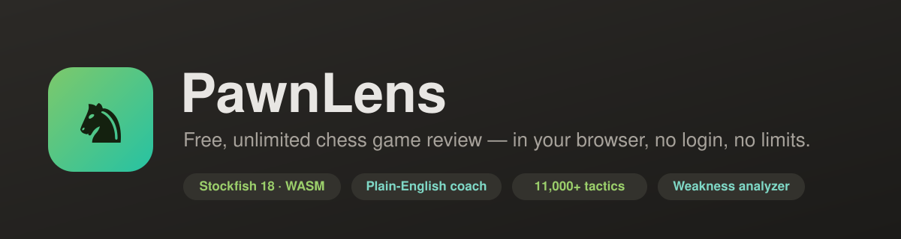
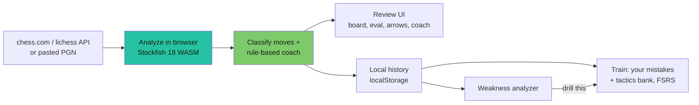
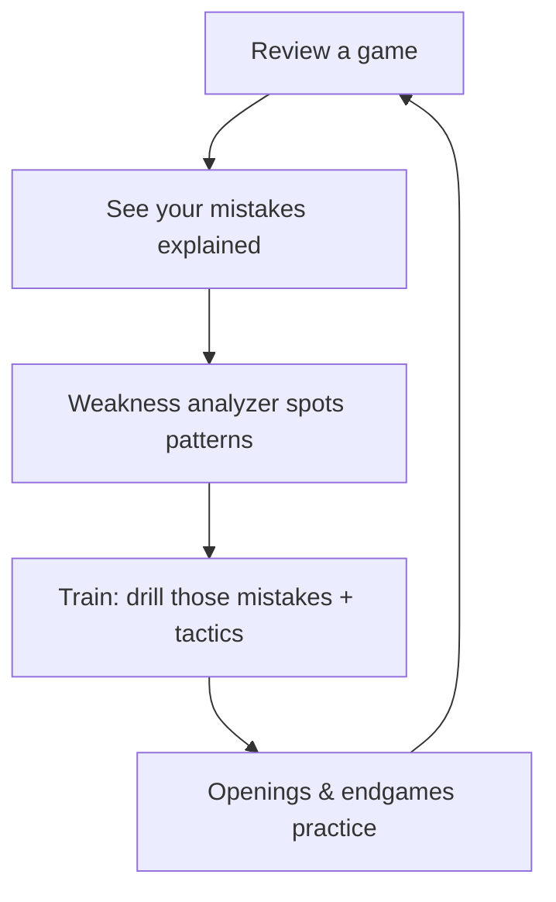

<p align="center">
  
</p>

<p align="center">
  <a href="LICENSE"></a>
  
  
  
  
  
</p>

<p align="center">
  <b>Understand your chess mistakes — for free, with no limits and no login.</b><br>
  A full game-review and training suite that runs <b>100% in the browser</b>: your CPU does the analysis, your data never leaves your machine.
</p>

---

## Why PawnLens?

Most sites gate real game review behind a paywall (chess.com allows ~1 free review a day). PawnLens gives you **unlimited** reviews and a complete training loop, built entirely on free and open data:

- **No server** — Stockfish 18 runs as WebAssembly in your browser. Zero hosting cost, infinite scale.
- **No login, no tracking** — history lives in your browser's local storage.
- **Not a chess.com clone** — the focus is *learning from your own mistakes*, not playing or social features.

## Table of contents

- [Features](#features)
- [How it works](#how-it-works)
- [Quick start](#quick-start)
- [The learning loop](#the-learning-loop)
- [Tech stack](#tech-stack)
- [Project structure](#project-structure)
- [Data & attribution](#data--attribution)
- [Roadmap](#roadmap)
- [Contributing](#contributing)
- [License](#license)

## Features

**Game review**
- Pull recent games by **chess.com** / **lichess** username, or paste / upload a **PGN**.
- **Stockfish 18** analysis of every move — eval bar, whole-game eval graph, best-move arrows.
- Own move classification: `Sharp · Best · Solid · Fine · Loose · Slip · Drop` (not chess.com's copyrighted system).
- **Plain-English coach** explaining *why* a move was wrong — hanging pieces, forks, pins, skewers, allowed mates, bad trades — plus the better plan. No LLM, no cost.
- **Accuracy** (harmonic mean, so blunders actually hurt) + a rough performance rating.
- **Turning points**, per-phase accuracy, the engine's top lines (deeper on demand), and how strong players handled the position (lichess Masters).
- **Result-aware**: shows resignation / time / checkmate / draw.

**Learn actively (right in the review)**
- **Guess-the-move** — play your move before the answer is revealed and get graded.
- **Show threats** — highlights hanging pieces + an arrow for the opponent's threat.
- **Try the better move** — play the engine's move and continue the line vs the engine.
- **Free explore** — an analysis board with live eval and take-backs.
- **Auto-narration**, move sounds, board & piece themes, light/dark, keyboard nav.

**Train**
- One ranked queue mixing **your own blunders** and a **3,300-puzzle tactics bank** (themes + ratings), scheduled with **FSRS** spaced repetition and an adjusting **puzzle rating**.
- Filter by theme (endgames, mates, middlegame) or drill a specific weakness in one click.

**Openings & endgames**
- **Openings trainer** — learn any of **3,807** named openings; you play your side, the bot answers.
- **Endgame trainer** — convert the classic technique wins against the engine.

**Weakness analyzer**
- Cross-game report that names your recurring mistakes, shows **the exact moves as evidence**, and jumps you straight into that position. Accuracy trend, mistake-by-move heatmap, worst openings.

## How it works



Everything after the fetch happens on the client — no backend is involved.

## Quick start

```bash
git clone https://github.com/Chaganti-Reddy/pawnlens.git
cd pawnlens
npm install
npm run dev       # http://localhost:5173
```

```bash
npm run build     # production build → dist/
npm run preview   # serve the build locally
npm run lint      # oxlint
```

Deploy the static `dist/` folder to any host (Cloudflare Pages, GitHub Pages, Netlify…). The only requirement is an SPA fallback (serve `index.html` for unknown routes).

> First analysis downloads the ~7&nbsp;MB Stockfish engine once, then it's cached.

## The learning loop



## Tech stack

| Area | Choice |
| --- | --- |
| UI | React 19 + Vite 8 |
| Engine | Stockfish 18 (lite, single-thread) via WebAssembly Web Worker |
| Chess logic | chess.js |
| Board | react-chessboard v5 |
| Routing | react-router |
| i18n | react-i18next (all copy in `src/locales`) |
| Icons | react-icons (no emoji in the UI) |
| Scheduling | FSRS-4.5 (custom implementation) |
| Storage | Browser `localStorage` |

## Project structure

```
public/engine/         Stockfish 18 .js + .wasm (GPLv3)
src/engine/            UCI Web Worker wrapper (serialized analyze queue)
src/lib/               analysis, classification, coach, openings/tactics data,
                       FSRS scheduler, puzzle rating, threats, sound, theme
src/components/        board, eval bar/graph, coach card, stats, compare, settings…
src/pages/             Home, Review, Train, Endgames, OpeningsDrill, Weakness
src/data/              openings.json, puzzles.json, endgames.json, cburnett pieces
src/locales/           en.json (i18n source of truth)
```

See [`docs/ARCHITECTURE.md`](docs/ARCHITECTURE.md) for a deeper tour.

## Data & attribution

All bundled data is free/open (see [`NOTICE.md`](NOTICE.md)):

- **Stockfish.js** — GPLv3 (chess.com / nmrugg).
- **Openings book** — lichess-org/chess-openings, CC0 (3,807 lines).
- **Tactics puzzles** — subset of the Lichess puzzle database, CC0.
- **cburnett piece set** — Colin M.L. Burnett, GPLv2+ (via lichess).

PawnLens is **not affiliated with** chess.com or lichess; it only uses their public, documented APIs and open data.

## Screenshots

> Drop UI captures into `docs/images/` and they'll render here. The review page is a three-column study view: **This move** (win %, coach, engine lines) · **Board** (eval bar, arrows, controls) · **Whole game** (result, turning points, move list).

## Roadmap

- [ ] One-click deploy config (Cloudflare Pages / GitHub Pages) + SPA fallback
- [ ] More coach motifs (discovered attacks, overloaded pieces, zugzwang)
- [ ] Optional bring-your-own-key LLM coaching
- [ ] More piece sets and board themes
- [ ] Progressive Web App (offline install)

## Contributing

Contributions welcome — see [`CONTRIBUTING.md`](CONTRIBUTING.md) and the [code of conduct](CODE_OF_CONDUCT.md). Ground rule: keep it **free and client-side** (no paid APIs, no servers). Run `npm run lint` and `npm run build` before opening a PR.

## License

[GPL-3.0](LICENSE) — because PawnLens bundles the GPLv3 Stockfish engine, the combined work is GPLv3.
